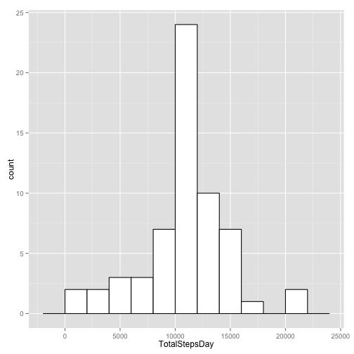
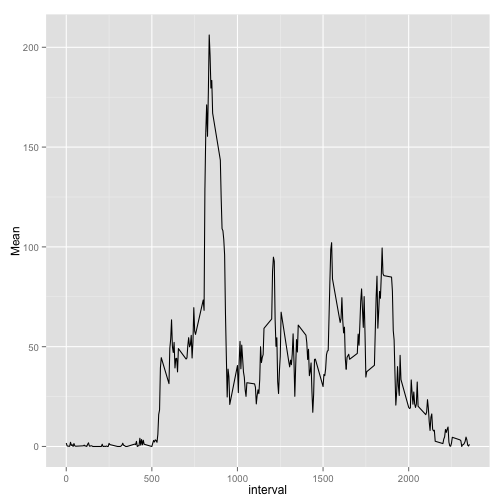
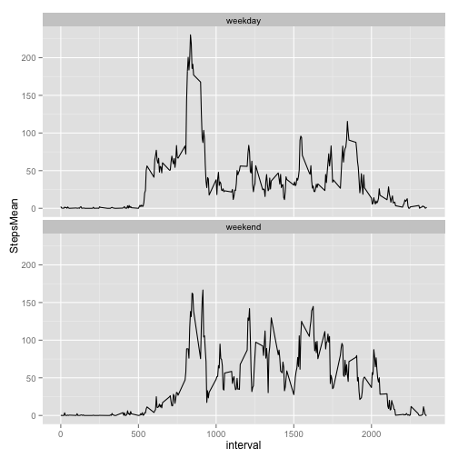

Reproducible Research: Peer Assessment 1
========================================================

## Loading and preprocessing the data

It is now possible to collect a large amount of data about personal movement using activity monitoring devices such as a Fitbit, Nike Fuelband, or Jawbone Up. These type of devices are part of the “quantified self” movement – a group of enthusiasts who take measurements about themselves regularly to improve their health, to find patterns in their behavior, or because they are tech geeks. But these data remain under-utilized both because the raw data are hard to obtain and there is a lack of statistical methods and software for processing and interpreting the data.

This assignment makes use of data from a personal activity monitoring device. This device collects data at 5 minute intervals through out the day. The data consists of two months of data from an anonymous individual collected during the months of October and November, 2012 and include the number of steps taken in 5 minute intervals each day.

For the first part of the assigment, all rows containing NAs are removed.


```r
require(ggplot2) 
library(data.table)

activityData <- read.table("activity.csv" ,sep=",",header=TRUE)
```

```
## Warning in file(file, "rt"): cannot open file 'activity.csv': No such file
## or directory
```

```
## Error in file(file, "rt"): cannot open the connection
```

```r
activityData <- activityData[complete.cases(activityData),]

head(activityData)
```

```
##       steps       date interval
## 1 1.7169811 2012-10-01        0
## 2 0.3396226 2012-10-01        5
## 3 0.1320755 2012-10-01       10
## 4 0.1509434 2012-10-01       15
## 5 0.0754717 2012-10-01       20
## 6 2.0943396 2012-10-01       25
```

```r
activityDT <- data.table(activityData)
activityDT <- activityDT[complete.cases(activityDT)]
```

## What is mean total number of steps taken per day?

The data.table library is used to calculate the total numbers of step per day.


```r
StepsByDate <- activityDT[,list('TotalStepsDay'=sum(steps)),
                        by=date]
```

Histograms of total number of steps per day:


```r
ggplot(StepsByDate, aes(x=TotalStepsDay)) + 
    geom_histogram(binwidth=2000,colour="black", fill="white")
```

 

Mean and median of Tatal numbers of steps:


```r
# Mean
mean(StepsByDate$Total)
```

```
## [1] 10766.19
```

```r
#Median
median(StepsByDate$Total)
```

```
## [1] 10766.19
```

## What is the average daily activity pattern?


```r
StepsByInterval <- activityDT[,list('Mean'=mean(steps)),
                        by=interval]
p <- ggplot(data = StepsByInterval, aes(x=interval,y=Mean)) 
p + geom_line()
```

 

Calculation of the maximum average of steps per interval:


```r
StepsByInterval[order(-Mean)][1]
```

```
##    interval     Mean
## 1:      835 206.1698
```

## Imputing missing values

Reload the data:

```r
activityData <- read.table("activity.csv" ,sep=",",header=TRUE)
```

```
## Warning in file(file, "rt"): cannot open file 'activity.csv': No such file
## or directory
```

```
## Error in file(file, "rt"): cannot open the connection
```

```r
activityDT <- data.table(activityData)
```

Calculate and report the total number of missing values in the dataset (i.e. the total number of rows with NAs)

We can see that the only field that includes NAs is the step field.


```r
# Missing values in steps variable
sum(is.na(activityData$steps))
```

```
## [1] 0
```

```r
# Missing values in date variable
sum(is.na(activityData$date))
```

```
## [1] 0
```

```r
# Missing values in interval variable
sum(is.na(activityData$interval))
```

```
## [1] 0
```

```r
# NAs by Date table
NAsByDate <- activityDT[,
                        list('sumNAs'=sum(is.na(steps))),
                        by=date
             ][sumNAs>0]
NAsByDate
```

```
## Empty data.table (0 rows) of 2 cols: date,sumNAs
```

The Strategy for filling the missing values in the dataset is to fill the NA with the mean for the 5-minute interval of that row.


```r
for (i in 1:length(activityData$interval)){
    if(is.na(activityData[i,]$steps)){
        activityData[i,1] <-
            StepsByInterval[interval==activityData[i,]$interval,Mean]
    }
}

sum(is.na(activityData$steps))
```

```
## [1] 0
```

```r
activityDT <- data.table(activityData)
```

Histogram of the total number of steps taken each day.


```r
StepsByDate <- activityDT[,list('TotalStepsDay'=sum(steps)),
                        by=date]

ggplot(StepsByDate, aes(x=TotalStepsDay)) + 
    geom_histogram(binwidth=2000,colour="black", fill="white")
```

 

Calculation and report the mean and median total number of steps taken per day.


```r
mean(StepsByDate$Total)
```

```
## [1] 10766.19
```

```r
median(StepsByDate$Total)
```

```
## [1] 10766.19
```

These values differ from the estimates from the first part of the assignment. The impact of imputing missing data on the estimates is to let the median get closer to the mean.

## Are there differences in activity patterns between weekdays and weekends?


```r
activityDT$weekday <- weekdays(as.Date(activityDT$date))

activityDT$weekend <- "weekday"
activityDT[weekday %in% c('Saturday','Sunday')]$weekend <- "weekend"

StepsByInterval <- activityDT[,list("StepsMean"=mean(steps)),
                        by=list(interval,weekend)]

ggplot(StepsByInterval, aes(interval,StepsMean))+geom_line()+
    facet_wrap(~weekend, ncol=1)
```

 
